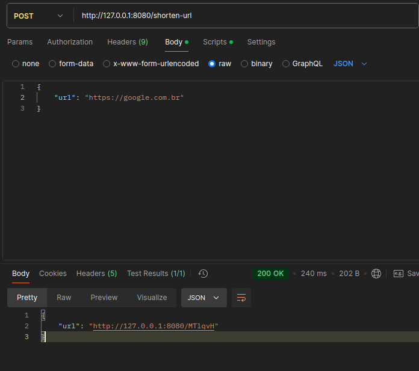

# Encurtador de URLs

Este projeto implementa um serviço simples de encurtamento de URLs, que recebe uma URL longa e a converte em um formato compacto e fácil de compartilhar. O serviço também oferece a funcionalidade de redirecionar para a URL original a partir da URL encurtada.

## Requisitos

- O encurtador de URLs recebe uma URL longa como parâmetro inicial.
- O encurtamento será composto por um mínimo de 5 e um máximo de 10 caracteres.
- Apenas letras e números são permitidos no encurtamento.
- A URL encurtada será salva no banco de dados com um prazo de validade (você pode escolher a duração desejada).
- Ao receber uma chamada para a URL encurtada, como `https://xxx.com/DXB6V`, o serviço redirecionará para a URL original salva no banco de dados.
- Caso a URL encurtada não seja encontrada no banco de dados, o código de status HTTP 404 (Not Found) será retornado.

# Créditos
Este projeto foi desenvolvido como parte do desafio Encurtador de URLs do repositório backend-br/desafios